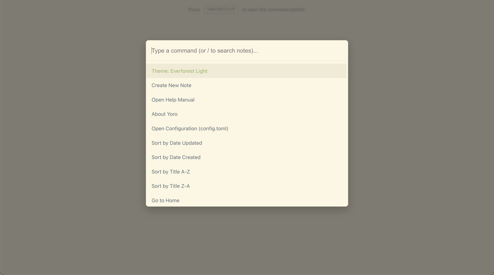
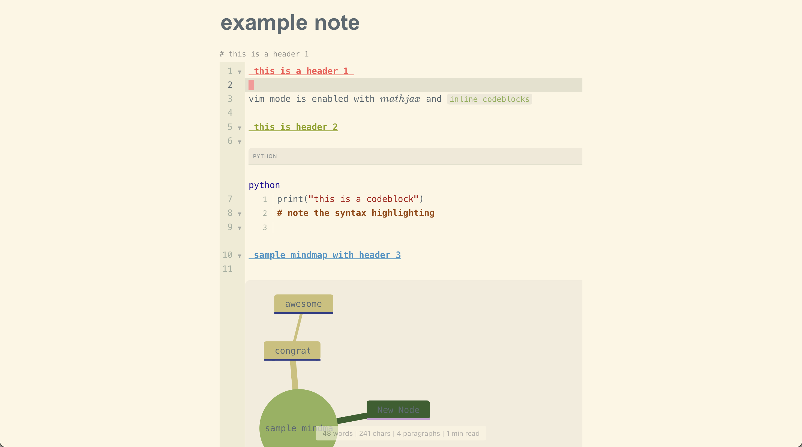
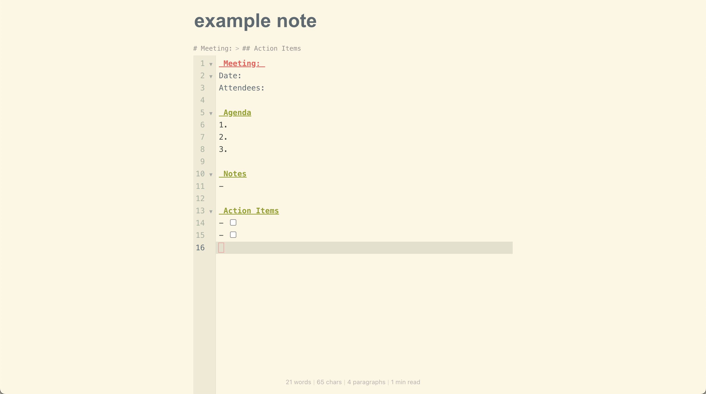
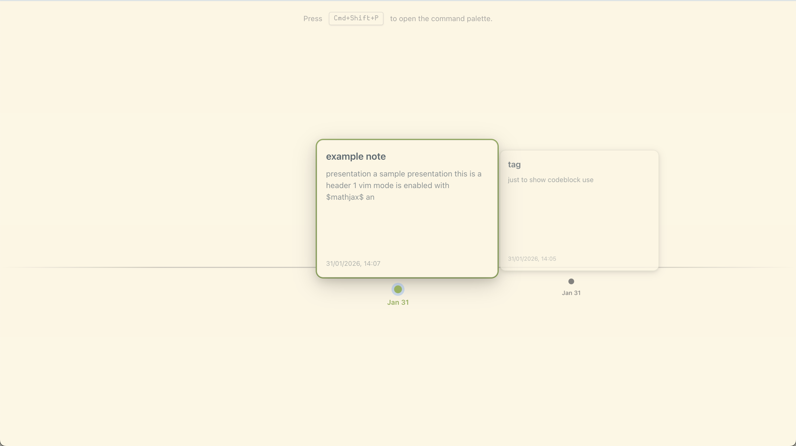
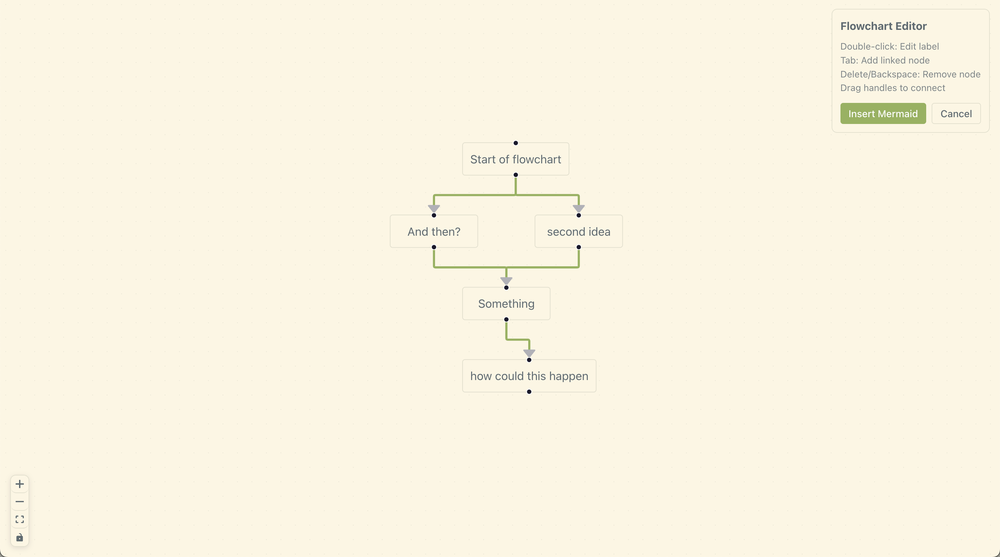
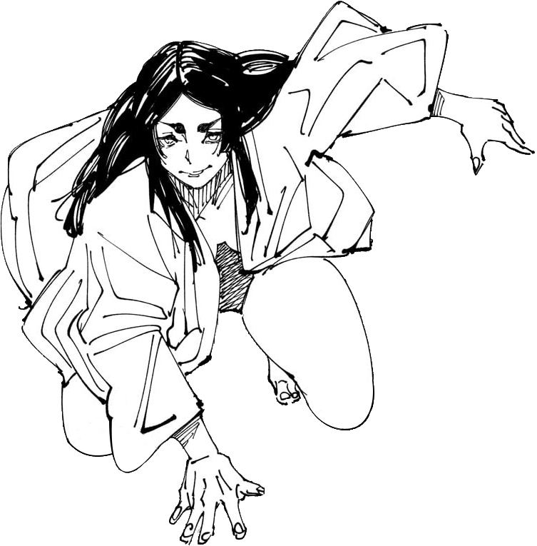

 

# `Yoro`

...

## Stack

...

## Screenshots

    
    

    
    

    
    

    
    

## Usage

...

## Features

...

## Architecture

## Reference

The name `Yoro` is in reference to [Yorozu](https://jujutsu-kaisen.fandom.com/wiki/Yorozu), a [reincarnated](https://jujutsu-kaisen.fandom.com/wiki/Category:Incarnations) [jujutsu sorcerer](https://jujutsu-kaisen.fandom.com/wiki/Jujutsu_Sorcerer) from Aizu during the [Heian Era](https://en.wikipedia.org/wiki/Heian_period), most prominently known for her infatuation with [Ryomen Sukuna](https://jujutsu-kaisen.fandom.com/wiki/Sukuna) in [Gege Akutami](https://jujutsu-kaisen.fandom.com/wiki/Gege_Akutami)'s acclaimed manga [*Jujutsu Kaisen*](https://jujutsu-kaisen.fandom.com/wiki/Jujutsu_Kaisen_Wiki). She first rises to prominence during the [Culling Game Arc](https://jujutsu-kaisen.fandom.com/wiki/Culling_Game_Arc) initiated by [Kenjaku](https://jujutsu-kaisen.fandom.com/wiki/Kenjaku). `Yoro` also happens to be the romanized pronounciation for よろ *(yoro)*, a casual closer in Japanese conversation that roughly translates to "please take care".

  

