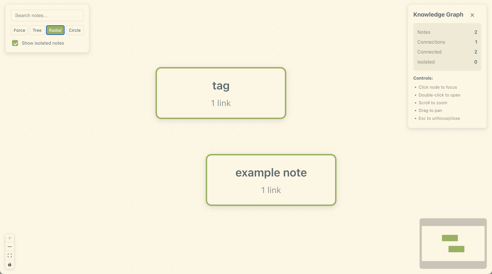
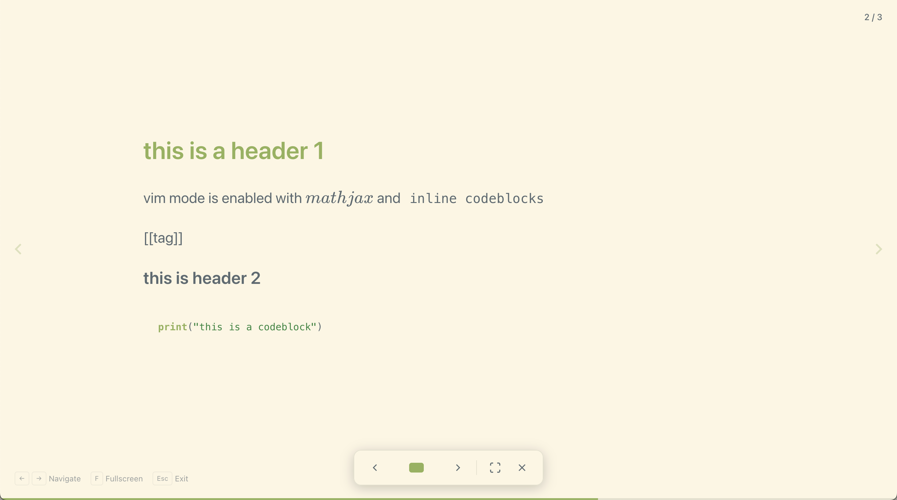
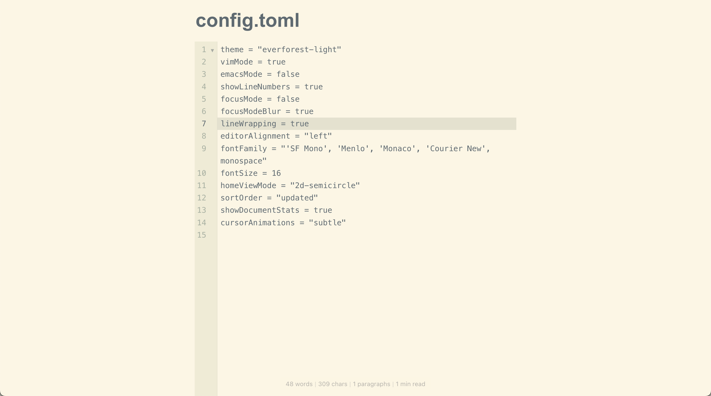
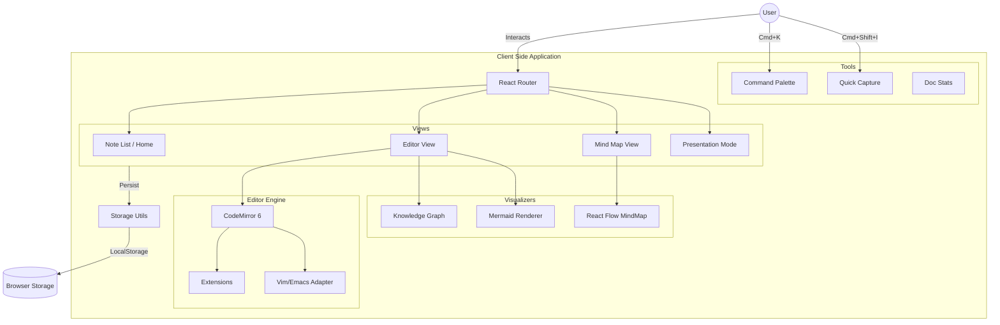

[](https://github.com/gongahkia/yoro/releases/tag/1.0.0) 


# `Yoro`

[No-nonsense](https://dictionary.cambridge.org/dictionary/english/no-nonsense), [privacy-first](https://www.thoughtworks.com/en-sg/insights/decoder/p/privacy-first) Text Editor Web App with a usable [out-of-the-box](https://en.wikipedia.org/wiki/Out_of_the_Box) [config](#screenshots).

## Stack

* *Frontend*: [React](https://react.dev/), [TypeScript](https://www.typescriptlang.org/), [Vite](https://vitejs.dev/)
* *Editor*: [CodeMirror](https://codemirror.net/) 
* *Visualization*: [React Flow](https://reactflow.dev/), [Mermaid](https://mermaid.js.org/), [Dagre](https://github.com/dagrejs/dagre) 
* *Math & Data*:[KaTeX](https://katex.org/), [smol-toml](https://github.com/squirrelchat/smol-toml), [gemoji](https://github.com/github/gemoji)
* *Storage*: [localStorage API](https://developer.mozilla.org/en-US/docs/Web/API/Window/localStorage) 
* *Export*: [html2pdf.js](https://ekoopmans.github.io/html2pdf.js/), [docx.js](https://docx.js.org/#/), [jszip](https://stuk.github.io/jszip/)

## Screenshots

<div align="center">
    
    
    
</div>

<div align="center">
    
    
    
</div>

<div align="center">
    
    
    
</div>

<div align="center">
    
    
    
</div>

## Usage

The easiest way to access `Yoro` is through the ***live link at [yoro-psi.vercel.app](https://yoro-psi.vercel.app/)***.

Alternatively, if you are so inclined, `Yoro` can be run locally with the following instructions.

1. First execute the below instructions to clone `Yoro` on your client machine and install dependancies.

```console
$ git clone https://github.com/gongahkia/yoro && cd yoro
$ npm install
```

2. Then run the below to build `Yoro` in development mode.

```console
$ npm run dev
```

## Architecture



## Reference

The name `Yoro` is in reference to [Yorozu](https://jujutsu-kaisen.fandom.com/wiki/Yorozu), a [reincarnated](https://jujutsu-kaisen.fandom.com/wiki/Category:Incarnations) [jujutsu sorcerer](https://jujutsu-kaisen.fandom.com/wiki/Jujutsu_Sorcerer) from Aizu during the [Heian Era](https://en.wikipedia.org/wiki/Heian_period), most prominently known for her infatuation with [Ryomen Sukuna](https://jujutsu-kaisen.fandom.com/wiki/Sukuna) in [Gege Akutami](https://jujutsu-kaisen.fandom.com/wiki/Gege_Akutami)'s acclaimed manga [*Jujutsu Kaisen*](https://jujutsu-kaisen.fandom.com/wiki/Jujutsu_Kaisen_Wiki). She first rises to prominence during the [Culling Game Arc](https://jujutsu-kaisen.fandom.com/wiki/Culling_Game_Arc) initiated by [Kenjaku](https://jujutsu-kaisen.fandom.com/wiki/Kenjaku). `Yoro` also happens to be the romanized pronounciation for よろ *(yoro)*, a casual closer in Japanese conversation that roughly translates to "please take care".

<div align="center">
  
</div>